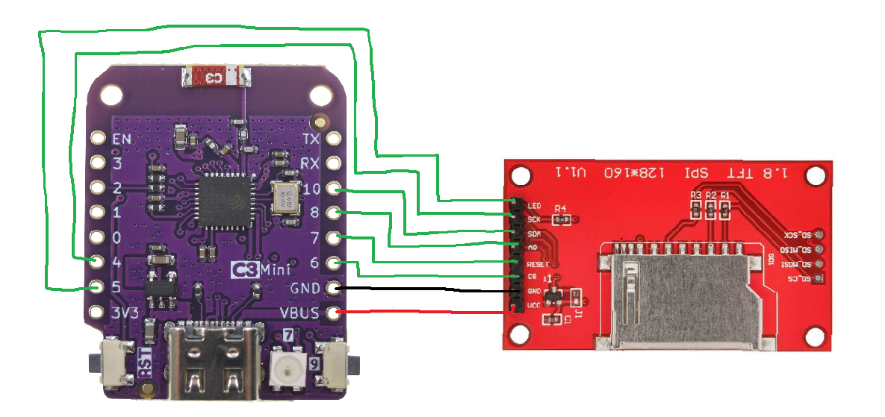

# Spotiplay

a compact, wifi-enabled spotify "now playing" display, themed on pokemon!!

it is built around an espc3-mini microcontroller and a 1.8" tft display, with a 3d printed case. the microcontroller will connect to wifi, authenticate with spotify, poll the playing track, and render the information into the display. three cherry mx switches will give the basic playback control for convenience. 

i made this project because i was reminded of this idea from the spotify car display, and when i saw a tutorial on it i saw a good opportunity to brush up on cad for more complex projects later on, and potentially be able to go hackclub's stasis hackathon.

